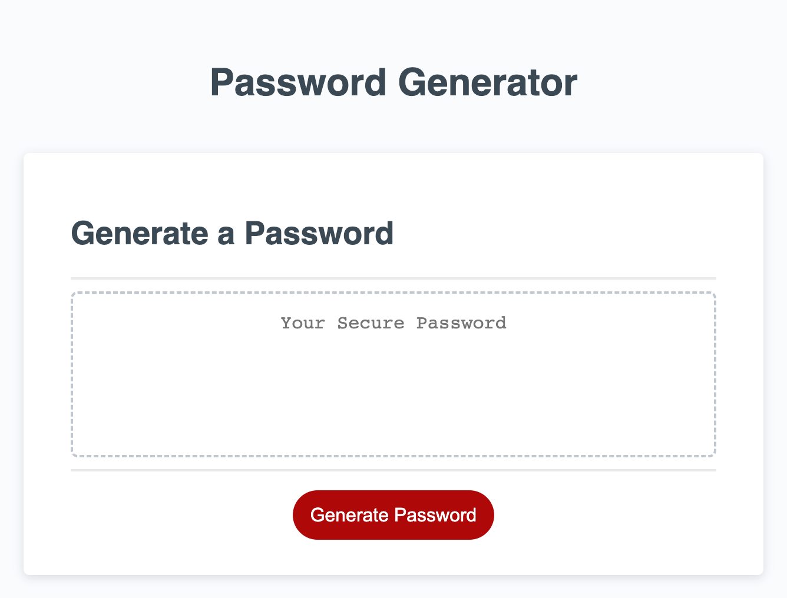

  # Can't Touch This! Password Generator 
  
  

  ## Table of Contents
  * [Description](#description)
  * [Installation](#installation)
  * [Usage](#usage)
  * [Contributors](#contributors)
  * [Test](#test)
  * [Questions](#questions)

  
* [License](#license)

    
  ## Description
  This web application can be used to generate random passwords for the user. 
  ## Installation
  Not Specfific
  ## Usage
  Can be used to help with password needs. 
  ## Contributors
  Landon M.
  ## License
  MIT License
  ## Test
  Select yes or no to the provided prompts that will either enclude numbers, letters, or special characters.

  ## Questions
  * Github : [LandoBM](https://github.com/LandoBM/)
  * E-Mail :landon.swdeveloper@gmail.com

  ## License
    Licensed using MIT License.

  ## Mock-Up
  The following image shows the web application's appearance and functionality:
  
  
  ## Deployment
  https://landobm.github.io/password-generator/
